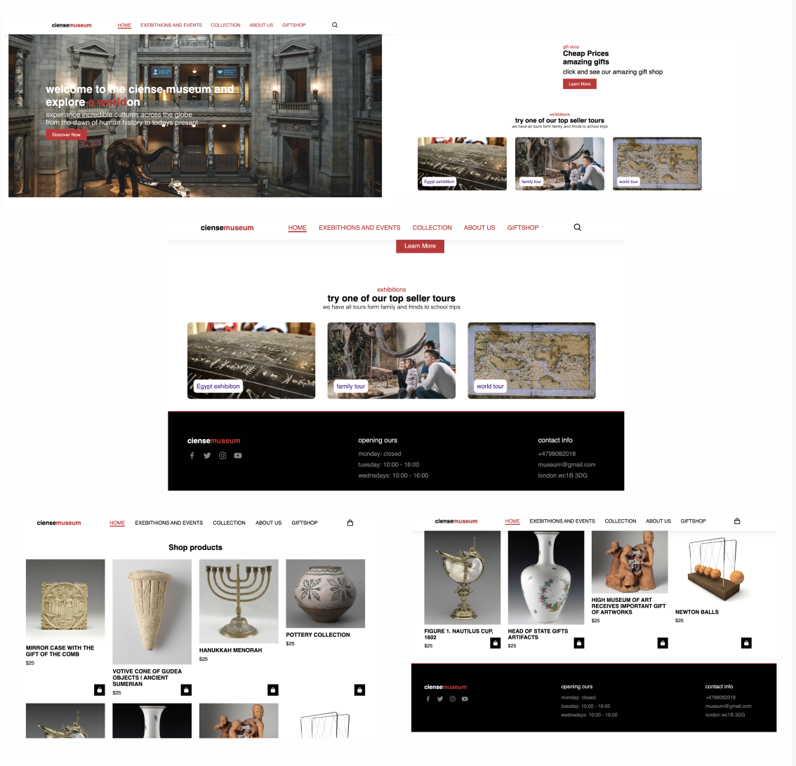
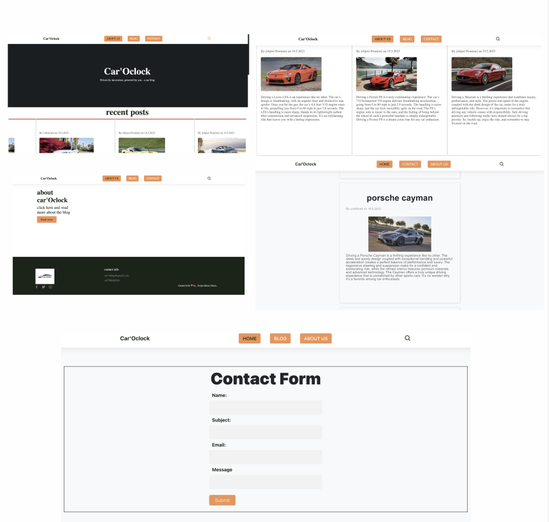
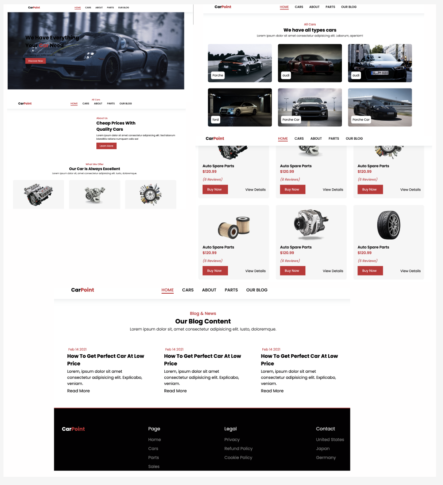

# 1. semester oppgaven min museum

Dette er en skjerm bilde av en av mine semester oppgaver

## Description

I denne oppgaven fik jeg i oppgave og lage en nettside til et museum.

i denne oppgaven har jeg:
 
 - planlagt et prosjekt 
 - designed en prototype med design programmet Figma
 - programert en full nettside

## Bygd med

- HTML
- CSS
- JavaScript

## Getting Started

link til siden som ligger på netlify 

https://dashing-begonia-a090a5.netlify.app

https://github.com/Torjnilsen/museumciense.git

# 2. Examen 1

Dette er en skjerm bilde av en av min første examens oppgave

## Description

I denne oppgaven fik jeg i oppgave og lage en nettside til en blog av valgfrit tema, ved hjelp av wordpress og Flywheel som backend server der jeg lagde blog inlegene mine og hentet i API form .

i denne oppgaven har jeg:
 
 - planlagt et prosjekt 
 - designed en prototype med design programmet Figma
 - lagd blog inlegg med bruk av wordpress
 - programert en full nettside

## Bygd med

- HTML
- CSS
- JavaScript

## link til netlify og github repo

link til siden som ligger på netlify 

https://statuesque-froyo-a59e1a.netlify.app

https://github.com/Noroff-FED-Campus-Assignments/fed1-exam-Torjnilsen.git

# Eget prosjekt

Dette er en skjerm bilde av en av mine egne prosjekter

## Description

 jeg startet dette prosjektet ved siden av skolen for. For og få mere erfaring og trening.

i denne oppgaven har jeg:
 
 - planlagt et prosjekt 
 - designed en prototype med design programmet Figma
 - programert en full nettside

## Bygd med

- HTML
- CSS
- JavaScript

## Getting Started

link til siden som ligger på netlify 

https://dashing-begonia-a090a5.netlify.app

https://github.com/Torjnilsen/museumciense.git